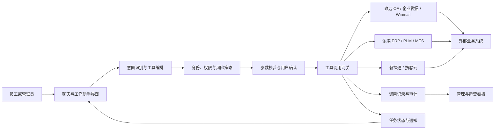

# 企业智能客服三期建设规划

## 一、文档说明

| 项目 | 内容 |
| --- | --- |
| 文档名称 | 企业智能客服三期建设规划 |
| 三期定位 | 从“知识问答与培训平台”升级为“可查询、可办理、可审计的企业智能工作助手” |
| 建设对象 | 员工端、管理端、业务系统连接器、工具调用网关、审批与审计体系 |
| 推荐周期 | 18-24 周，按 3A/3B/3C 三个接入波次推进，并根据厂商接口和联调条件滚动调整 |
| 部署原则 | 沿用现有 Next.js、MySQL、PM2 和腾讯云部署，不影响一期、二期生产链路 |
| 文档状态 | 三期实施基线 |

本文档定义三期的产品范围、技术架构、实施阶段、数据模型、权限安全、测试部署和验收标准。实际开发前，需要对每个外部业务系统完成接口、账号、网络和测试环境确认；未满足接入条件的系统不得用模拟成功替代正式验收。

## 二、建设背景

### 2.1 已有基础

一期和二期已经形成以下生产能力：

- 企业知识库、资料解析、OCR、本地文本 RAG 和 OpenAI File Search。
- 员工智能问答、引用来源、会话历史、反馈与人工工单。
- 角色、部门、岗位、密级、知识库可见范围和单文档 ACL。
- 资料审批发布、版本管理、回滚和完整操作审计。
- PPT 讲稿、MeloTTS 语音缓存、课程发布、学习进度和完课统计。
- 安全事件、通知中心、QA 回归、运行监控、备份恢复和 CI/CD 基础。

这些能力解决了“知道什么”和“如何学习”的问题，但员工仍需跳转到不同业务系统查询数据、填写表单和跟踪流程。三期需要解决“下一步如何办理”的问题。

### 2.2 三期定义

三期不再扩大通用聊天功能，而是接入 OA、HR、CRM、ERP、工单、财务等业务系统，让员工在权限范围内通过自然语言完成：

1. 查询本人或授权范围内的实时业务数据。
2. 获取可解释、带来源和更新时间的业务结果。
3. 在明确确认后发起低风险业务操作。
4. 查看任务执行、审批和失败处理状态。
5. 由管理员统一管理连接器、工具、权限、风险和审计。

### 2.3 现有业务系统清单

三期按公司当前实际使用的 8 套系统规划，不再以抽象系统代替：

| 系统 | 三期定位 | 首批建议能力 | 主要风险 | 建议波次 |
| --- | --- | --- | --- | --- |
| 致远 OA | 审批与协同门户 | 我的待办、我发起的流程、审批状态、流程链接 | 审批意见和流程权限 | 3A |
| 薪福通 | 薪酬福利与员工服务 | 本人薪资单状态、福利或个税事项入口；具体字段按实际模块确认 | 薪资和个人敏感信息 | 3C |
| 企业微信 | 企业身份、消息与通讯入口 | 账号身份映射、站内通知外发、业务结果提醒 | 通讯录和消息发送权限 | 3A |
| Winmail 邮箱 | 企业邮件服务 | 未读数量、邮件摘要、业务通知；发送能力先做草稿或确认后发送 | 邮件正文、附件和误发送 | 3A |
| 金蝶 ERP | 采购、销售、库存、财务等经营数据 | 授权物料、库存、采购单、销售单状态查询 | 财务数据和库存写入 | 3B |
| 携客云 | 客户与业务协同；具体模块以现网为准 | 授权客户、联系人、跟进或商机摘要查询 | 客户归属和商业敏感数据 | 3C |
| PLM | 产品、BOM、图纸、版本和变更管理 | 产品/BOM/图纸版本、变更单状态查询 | 技术资料密级和版本准确性 | 3B |
| MES | 生产执行与现场状态 | 工单进度、产量、设备或质量状态摘要 | 生产实时性和车间数据范围 | 3B |

表中的能力是规划候选，不代表厂商接口已经确认。阶段 3.0 必须逐套核对产品全称、版本、部署地址、官方接口、授权方式、测试环境和系统负责人后，才能冻结具体工具清单。

## 三、建设目标

### 3.1 总体目标

建设统一的业务系统连接与工具调用平台，将现有智能客服升级为企业智能工作助手，实现“识别意图、匹配工具、权限校验、参数补全、用户确认、业务执行、结果回传、全程审计”的闭环。

### 3.2 业务目标

- 员工常见业务查询无需在多个系统间重复登录和查找入口。
- 高频、规则明确的流程可以从对话中直接发起。
- 业务办理结果可跟踪，失败时有明确原因和人工处理入口。
- 新系统接入采用连接器标准，不为每个系统重写整套调用流程。
- 所有工具调用遵循最小权限、明确确认、幂等执行和审计留痕。

### 3.3 建议指标

| 指标 | 三期目标 |
| --- | --- |
| 首批可用业务工具 | 不少于 8 个，其中写操作不超过 3 个 |
| 只读查询成功率 | 不低于 99%（排除外部系统明确不可用时间） |
| 写操作重复执行率 | 0 |
| 越权调用拦截率 | 100% |
| 高风险操作确认覆盖率 | 100% |
| 工具调用审计完整率 | 100% |
| 常用业务平均办理步骤 | 相比原流程减少 30% 以上 |
| 工具调用 P95 响应时间 | 只读查询不超过 5 秒，异步任务在 3 秒内返回受理状态 |

## 四、建设原则

1. **先查询，后办理**：首批只开放低风险查询；查询稳定后再开放写操作。
2. **先确定性路由，后自主规划**：优先采用工具白名单和结构化参数，不允许模型自由拼接接口地址或 SQL。
3. **身份权限不透传猜测**：所有权限由服务端根据当前登录用户和授权策略计算，模型输出不能作为授权依据。
4. **凭据与模型隔离**：外部系统密钥只保存在服务端密钥环境或密钥管理服务，不进入提示词、浏览器或审计正文。
5. **写操作必须确认**：提交、创建、修改、撤销等操作必须展示结构化确认单，用户确认后才执行。
6. **高风险必须审批**：涉及资金、合同、人事变更、批量操作或敏感数据时，转入原业务系统或企业审批流，不允许模型直接完成。
7. **默认最小化存储**：仅保存执行所需参数摘要、结果摘要和审计信息，不复制外部系统完整业务库。
8. **失败可恢复**：连接超时、参数错误、外部拒绝和重复请求必须可区分、可重试、可转人工。
9. **连接器可停用**：任一外部系统异常时，可单独禁用对应连接器，不影响知识问答、培训和其他服务。

## 五、用户与角色

| 角色 | 主要能力 |
| --- | --- |
| 员工 | 查询本人数据、发起允许的流程、确认操作、查看自己的执行记录 |
| 部门负责人 | 查询授权部门汇总、处理部门范围内待办、查看部门业务执行情况 |
| 业务系统管理员 | 配置自己负责系统的连接器、工具映射、字段和测试账号 |
| 安全审核员 | 审核高风险工具、查看越权和异常调用、停用风险连接器 |
| 系统管理员 | 管理全部连接器、工具权限、发布版本、告警和回滚 |
| 审计人员 | 只读查看调用人、工具、确认、审批、结果和时间线 |

现有 `admin` 和 `employee` 角色继续保留。三期新增的管理职责应通过独立授权表表达，避免把所有业务管理员都提升为系统管理员。

## 六、业务场景与接入波次

### 6.1 波次 3A：办公协同

优先接入致远 OA、企业微信和 Winmail，先解决员工每天高频使用的待办、通知和邮件查询：

| 系统 | 工具候选 | 数据范围 | 执行策略 |
| --- | --- | --- | --- |
| 致远 OA | 查询我的待办、查询我发起的流程、查询流程状态 | 仅本人或当前用户有权处理的流程 | 只读，返回原流程链接 |
| 企业微信 | 同步身份映射、发送本人业务结果提醒 | 当前登录用户；管理员配置的通知对象 | 身份同步需审计，消息发送使用模板白名单 |
| Winmail | 查询未读数量、按条件查询邮件摘要 | 仅本人邮箱 | 默认不读取完整正文和附件 |
| Winmail | 生成邮件草稿、确认后发送 | 仅本人邮箱和允许的收件范围 | 草稿低风险；正式发送必须确认和幂等 |

波次 3A 应先打通统一身份映射：系统账号需要分别绑定致远 OA 用户、企业微信 `userid` 和 Winmail 邮箱。身份绑定由服务端或管理员完成，不允许模型根据姓名猜测外部账号。

### 6.2 波次 3B：制造经营查询

接入金蝶 ERP、PLM 和 MES，聚焦只读、可追溯的生产经营数据：

| 系统 | 工具候选 | 数据范围 | 执行策略 |
| --- | --- | --- | --- |
| 金蝶 ERP | 查询物料、授权仓库库存、采购/销售单状态 | 按组织、仓库、部门和业务归属 | 只读；财务金额按权限脱敏 |
| PLM | 查询产品、BOM、图纸版本和变更单状态 | 按项目、产品、部门和资料密级 | 只返回有权版本，文件下载仍走 PLM |
| MES | 查询生产工单进度、产量、设备/质量状态摘要 | 按工厂、车间、产线和岗位 | 标注数据时间，禁止把缓存当实时状态 |

这一波次不得开放库存调整、BOM 修改、工艺变更、生产报工或质量放行等写操作。业务结果必须带单据号、版本号或工单号，并提供原系统查看入口。

### 6.3 波次 3C：人事、客户与低风险办理

接入薪福通和携客云，并在前两波稳定后开放少量写操作：

| 系统 | 工具候选 | 数据范围 | 执行策略 |
| --- | --- | --- | --- |
| 薪福通 | 查询本人薪资单是否发布、福利或个税事项状态 | 严格仅本人 | 默认只返回状态和入口；金额需再次身份确认 |
| 携客云 | 查询授权客户、联系人、跟进和商机摘要 | 按客户归属、团队和部门 | 客户联系方式按字段脱敏 |
| 携客云 | 创建客户拜访纪要草稿或跟进任务 | 有权维护的客户 | 必须确认，只创建草稿或待办 |
| 致远 OA | 发起规则明确的申请草稿 | 本人可发起的流程模板 | 必须确认，复杂表单跳转原系统完成 |

“薪福通”和“携客云”的具体产品模块与开放接口需要在阶段 3.0 核实。没有官方接口时，只提供安全深链和办理指引，不采用页面抓取或保存用户密码的方式接入。

### 6.4 跨系统工作流候选

- **生产异常协同**：MES 获取异常摘要，关联 PLM 图纸/BOM 版本，在致远 OA 创建异常处理草稿，并通过企业微信通知负责人。
- **采购进度助手**：金蝶 ERP 查询采购单和入库状态，致远 OA 查询关联审批，向当前用户汇总进度。
- **客户交付跟踪**：携客云读取客户和订单线索，金蝶 ERP 查询订单，MES 查询生产进度，只生成汇总，不自动承诺交期。
- **产品变更通知**：PLM 查询已生效变更，生成知识资料或培训候选，经人工审核发布后通过企业微信通知授权人员。
- **员工事项助手**：薪福通返回本人事项状态，致远 OA 返回相关审批，Winmail 或企业微信发送结果提醒。

跨系统工作流不得采用一次性“全部执行”。系统必须展示每一步来源、依赖、状态和确认点，并允许在失败点停止或人工接管。

所有查询结果必须展示来源系统、查询时间和数据范围。找不到结果时明确区分“没有数据”“无权查看”“尚未绑定外部身份”和“外部系统不可用”。

## 七、总体架构



### 7.1 核心模块

#### 业务系统连接器

- 统一封装 Base URL、认证方式、超时、重试、限速和健康检查。
- 支持 REST/JSON 作为首选协议，按实际需要扩展 SOAP、数据库只读视图或消息队列。
- 每个连接器独立启用、停用、测试和发布。
- 生产凭据与测试凭据完全隔离。

#### 工具注册中心

每个可调用工具必须声明：

- 工具 ID、名称、用途和所属连接器。
- 只读或写入类型、风险等级和数据敏感级别。
- JSON Schema 输入参数和结构化输出字段。
- 允许的角色、部门、岗位和指定用户范围。
- 是否需要二次确认、审批或人工接管。
- 超时、重试、幂等和结果缓存策略。
- 版本号、发布状态和负责人。

#### 工具调用编排

- 模型只负责选择已发布工具并生成候选参数。
- 服务端再次校验工具是否存在、是否启用、用户是否有权、参数是否符合 Schema。
- 参数不完整时只追问缺失字段，不执行调用。
- 一个会话中每次写操作只能对应一个确认单和一个幂等键。
- 多步骤任务由确定性状态机执行，模型不能跳过步骤或篡改状态。

#### 确认与审批

- 只读低风险工具可直接执行，但仍记录审计。
- 中风险查询可要求用户确认查询范围。
- 所有写操作展示确认单，包含目标系统、操作内容、关键字段、影响范围和取消入口。
- 高风险操作进入审批或跳转原系统处理，助手仅跟踪状态。

#### 异步任务与通知

- 超过同步响应时间的调用转为异步任务。
- 员工可查看排队、执行中、成功、失败、取消和需人工处理状态。
- 状态变化复用现有站内通知，并按配置发送企业微信或邮件 Webhook。

## 八、工具调用标准

### 8.1 标准执行链路

```text
用户请求
-> 意图识别
-> 候选工具匹配
-> 服务端权限与风险校验
-> 参数补全和 Schema 校验
-> 生成确认单（写操作必需）
-> 用户确认或进入审批
-> 生成幂等键
-> 调用连接器
-> 标准化结果
-> 保存审计与状态
-> 返回结果和后续操作
```

### 8.2 统一结果格式

连接器输出统一为：

```json
{
  "status": "succeeded",
  "summary": "已查询到 2 条待办",
  "data": {},
  "source_system": "oa",
  "source_record_ids": ["masked-id"],
  "occurred_at": "2026-07-12T10:00:00+08:00",
  "retryable": false,
  "next_actions": []
}
```

禁止把外部系统原始异常堆栈、Access Token、Cookie、数据库连接信息或未脱敏响应直接返回浏览器。

### 8.3 错误分类

| 错误类型 | 处理方式 |
| --- | --- |
| 参数不完整 | 提示用户补充缺失字段，不调用外部系统 |
| 无权限 | 返回无权访问并写入安全审计，不泄露资源是否存在 |
| 认证失败 | 停止调用并通知连接器管理员检查凭据 |
| 外部超时 | 只读查询可有限重试；写操作先查幂等状态再决定是否重试 |
| 外部限流 | 按 `Retry-After` 退避，必要时转异步任务 |
| 业务拒绝 | 展示外部系统返回的可公开原因和处理建议 |
| 未知结果 | 标记“需核对”，禁止直接重试写操作 |

## 九、数据模型规划

建议新增以下核心表，MySQL 与 Supabase schema 同步维护：

### 9.1 `integration_connectors`

- `id`、`name`、`provider`、`base_url`。
- `auth_type`、`credential_ref`，只保存密钥引用，不保存明文密钥。
- `environment`、`status`、`timeout_ms`、`retry_policy`。
- `health_status`、`last_checked_at`、`last_error`。
- `created_by`、`updated_by`、`created_at`、`updated_at`。

### 9.2 `integration_tools`

- `id`、`connector_id`、`tool_key`、`name`、`description`。
- `operation_type`、`risk_level`、`sensitivity_level`。
- `input_schema`、`output_schema`、`endpoint_config`。
- `requires_confirmation`、`requires_approval`、`idempotency_enabled`。
- `roles`、`departments`、`positions`、`allowed_users`。
- `version`、`publish_status`、`created_by`、`published_by`。

### 9.3 `integration_user_identities`

- `id`、`user_id`、`connector_id`、`external_user_id`、`external_login`。
- `mapping_source`、`verification_status`、`verified_at`、`last_synced_at`。
- 用于绑定本系统账号与致远 OA、企业微信、Winmail、薪福通等外部身份。
- 外部账号标识按敏感字段处理；同一连接器下的外部账号必须唯一。

### 9.4 `tool_execution_requests`

- `id`、`user_id`、`conversation_id`、`tool_id`、`tool_version`。
- `status`、`risk_level`、`input_snapshot`、`input_hash`。
- `confirmation_status`、`confirmed_at`、`approval_request_id`。
- `idempotency_key`、`external_request_id`、`external_record_id`。
- `result_summary`、`result_snapshot`、`error_code`、`error_message`。
- `started_at`、`completed_at`、`created_at`。

敏感输入和结果应按字段策略脱敏或加密，审计查询默认只展示摘要。

### 9.5 `tool_execution_events`

- 记录请求创建、参数补全、权限校验、用户确认、审批、开始执行、重试、成功、失败、取消和人工接管。
- 每条事件包含操作者、来源 IP、用户代理、前后状态、公开说明和受保护元数据。

### 9.6 `integration_permission_policies`

- 独立维护连接器和工具授权。
- 支持角色、部门、岗位、人员、数据范围和有效期。
- 明确区分“可发现工具”“可执行查询”“可执行写入”“可管理连接器”。

### 9.7 `workflow_definitions` 与 `workflow_runs`

- 仅在第三批跨系统工作流启用。
- 定义步骤、依赖、补偿动作、超时、失败策略和版本。
- 运行记录保存当前步骤、步骤结果、人工确认点和最终状态。

## 十、接口规划

### 10.1 管理接口

| 接口 | 方法 | 用途 |
| --- | --- | --- |
| `/api/admin/integrations/connectors` | GET/POST | 查询和创建连接器 |
| `/api/admin/integrations/connectors/[id]` | PATCH/DELETE | 更新、停用或删除未使用连接器 |
| `/api/admin/integrations/connectors/[id]/test` | POST | 使用脱敏测试参数执行连通性检查 |
| `/api/admin/integrations/tools` | GET/POST | 管理工具定义 |
| `/api/admin/integrations/tools/[id]` | PATCH | 编辑、发布、下架工具 |
| `/api/admin/integrations/policies` | GET/POST | 管理工具授权策略 |
| `/api/admin/integrations/executions` | GET | 查询调用与审计记录 |
| `/api/admin/integrations/health` | GET | 查看连接器健康、延迟和错误率 |

### 10.2 员工接口

| 接口 | 方法 | 用途 |
| --- | --- | --- |
| `/api/tools/available` | GET | 返回当前用户可发现的工具能力 |
| `/api/tools/prepare` | POST | 匹配工具、校验参数并生成调用预览 |
| `/api/tools/execute` | POST | 执行只读工具或已确认的写操作 |
| `/api/tools/executions/[id]` | GET | 查看本人调用状态与结果 |
| `/api/tools/executions/[id]/confirm` | POST | 确认或取消待执行操作 |
| `/api/tools/executions/[id]/retry` | POST | 按服务端策略重试允许重试的任务 |
| `/api/workflows/[id]` | GET | 查看跨系统工作流进度 |

所有接口继续使用现有登录会话，不接受客户端提交 `user_id` 作为身份依据。

## 十一、前端体验规划

### 11.1 员工端

- 对话回答中的业务结果使用紧凑结构化结果区，不输出大段接口 JSON。
- 查询结果显示来源系统、更新时间、数据范围和“在原系统查看”入口。
- 写操作使用确认对话框，关键字段可返回修改，确认按钮明确描述实际动作。
- 消息内显示执行中、成功、失败、需审批和需人工处理状态。
- 新增“我的办理”页面，统一查看工具调用、流程状态和失败重试。
- 工具不可用时保留知识问答能力，并给出原系统入口或人工处理方式。

### 11.2 管理端

- 新增“业务集成”导航，包含连接器、工具、授权、执行记录和健康状态。
- 连接器配置采用点击后展开的独立配置面板，密钥字段默认掩码。
- 工具发布前展示输入 Schema、权限、风险、确认和测试结果检查单。
- 看板展示调用量、成功率、P95 延迟、失败原因、风险拦截和外部系统可用性。
- 审计详情按时间线展示，但敏感参数只显示脱敏值。

## 十二、权限与安全设计

### 12.1 权限模型

工具执行权限由以下条件共同决定：

```text
用户状态有效
AND 工具已发布
AND 连接器已启用
AND 角色/部门/岗位/指定用户策略匹配
AND 数据范围策略匹配
AND 风险条件满足
AND 必要确认或审批已完成
```

管理员权限不能自动替代外部业务系统的数据权限。外部系统支持用户委托令牌时优先使用用户身份；仅支持服务账号时，必须在本系统执行严格数据范围过滤，并由外部系统再次校验可用条件。

### 12.2 安全控制

- 连接器 URL 使用域名白名单，禁止访问本机、云元数据地址和任意内网地址，防止 SSRF。
- 请求方法、路径和请求体由发布后的工具模板生成，模型不能提供完整 URL 或 Header。
- 工具参数执行 JSON Schema 校验、长度限制、枚举限制和危险字符检查。
- 所有外部响应先经过大小限制、类型校验和敏感字段脱敏。
- 防止提示词注入诱导工具越权，工具说明与外部返回内容均视为不可信数据。
- 写操作使用一次性确认令牌和幂等键，令牌绑定用户、工具、参数摘要和有效期。
- 高风险或连续失败行为写入现有安全事件并触发管理员告警。
- 密钥轮换不需要修改工具定义；日志禁止记录密钥、认证头和完整个人敏感数据。

### 12.3 风险分级

| 级别 | 示例 | 执行策略 |
| --- | --- | --- |
| 低 | 查询本人年假、查询本人工单 | 权限校验后直接执行 |
| 中 | 查询考勤明细、客户资料、部门汇总 | 限定范围，必要时确认并加强审计 |
| 高 | 创建申请、创建工单、修改客户任务 | 必须确认，部分场景需要审批 |
| 严重 | 支付、合同生效、人事变更、库存调整、批量删除 | 三期不直接执行，只跳转原系统或进入正式审批 |

## 十三、实施阶段

### 阶段 3.0：外部条件盘点与安全基线（1-2 周）

**工作内容**

- 逐一盘点致远 OA、薪福通、企业微信、Winmail、金蝶 ERP、携客云、PLM、MES 的产品全称、厂商、版本、部署方式、接口文档、负责人和测试环境。
- 确认认证方式、网络连通、IP 白名单、接口限流、字段字典和数据权限。
- 为 8 套系统分别形成“官方 API、Webhook、只读视图、安全深链或暂不可接入”的结论，并选定波次 3A 的首批只读场景。
- 完成数据分级、风险分级、日志保留期和应急停用规则。

**交付物**

- 《业务系统接入清单》。
- 《首批工具与字段映射表》。
- 测试账号、测试数据和联调环境。
- 接入风险评审记录。

**退出条件**

- 致远 OA、企业微信、Winmail 中至少一个系统具备可调用测试接口。
- 权限、网络和测试数据责任人明确。
- 不具备真实接口的系统不进入下一阶段验收。

### 阶段 3.1：统一连接器与工具底座（2-3 周）

**工作内容**

- 实现连接器、工具注册、权限策略、调用记录和健康检查数据模型。
- 实现服务端工具网关、Schema 校验、超时、重试、脱敏和审计。
- 建设管理端连接器配置、测试和工具发布页面。
- 接入安全事件、通知、运行监控和部署预检。

**退出条件**

- 连接器可独立启停，停用不影响其他模块。
- 模型不能调用未发布工具或自定义 URL。
- 权限和参数错误在访问外部系统前被拦截。
- 数据库迁移有 MySQL/Supabase 版本和回滚脚本。

### 阶段 3.2：波次 3A 办公协同 MVP（3-4 周）

**工作内容**

- 接入致远 OA、企业微信、Winmail 中至少两个真实系统。
- 上线 4-6 个身份、待办、通知或邮件只读工具；邮件发送默认不在本阶段开放。
- 在聊天中完成意图识别、参数追问、调用和结构化结果展示。
- 建设“我的办理”和管理员执行审计页面。
- 小范围灰度给指定部门和员工。

**退出条件**

- 真实业务数据查询成功，结果与原系统一致。
- 本系统用户与外部账号使用已验证身份映射，不通过姓名猜测。
- 本人、部门和越权用户三类权限测试通过。
- 外部系统不可用时不会影响知识问答。
- 只读查询成功率和响应时间达到目标。

### 阶段 3.3：波次 3B 制造经营查询（4-6 周）

**工作内容**

- 接入金蝶 ERP、PLM、MES 的官方接口、Webhook 或经审批的只读视图。
- 上线物料/库存、业务单据、产品/BOM/图纸版本、变更单和生产工单等只读工具。
- 建立组织、仓库、项目、产品、工厂、车间和产线数据范围映射。
- 对金额、客户、图纸和质量字段执行分级脱敏。

**退出条件**

- 金蝶 ERP、PLM、MES 中至少两个系统在生产灰度稳定运行。
- 查询结果与原系统的单据号、版本号、工单号和更新时间一致。
- 无权用户无法通过改参数查询其他组织、仓库、项目或产线数据。
- 不开放库存、BOM、工艺、报工和质量放行写操作。

### 阶段 3.4：波次 3C 与低风险办理（3-4 周）

**工作内容**

- 完成薪福通和携客云接口能力评审，并至少接入其中一个真实系统。
- 上线严格仅本人的薪酬福利事项状态查询，或按客户归属授权的客户业务查询。
- 上线 1-3 个创建草稿、订阅提醒或发起申请类低风险工具。
- 实现确认令牌、幂等键、审批衔接和未知结果保护。
- 实现异步任务状态、失败重试、取消和人工接管。
- 完成重复点击、网络超时和外部成功但本地超时等异常测试。

**退出条件**

- 所有写操作都经过确认或审批。
- 重复提交不会产生重复业务单据。
- 未知结果不会自动重试写操作。
- 外部系统记录、助手记录和审计记录可以相互追溯。

### 阶段 3.5：跨系统工作流与运营（3 周）

**工作内容**

- 从生产异常协同、采购进度、客户交付、产品变更通知和员工事项中选择一个高价值场景建立版本化状态机。
- 补齐前三个波次未达到的生产接入和工具数量，确保三期总体验收门槛可达成。
- 实现步骤确认、失败停止、补偿或人工处理。
- 建设业务工具运营看板、异常告警和灰度策略。
- 形成连接器开发模板和新系统接入手册。

**退出条件**

- 工作流每一步可追踪、可停止、可恢复。
- 任一连接器停用后不会继续执行依赖步骤。
- 8 套系统全部完成接口与安全评审，至少 6 套完成生产接入并覆盖 3A、3B、3C，真实可用工具不少于 12 个。
- 生产回滚演练和连接器应急停用演练通过。

## 十四、测试策略

### 14.1 单元与规则测试

- 工具发现、权限策略和数据范围判定。
- JSON Schema 参数验证和危险输入拒绝。
- 风险分级、确认令牌、幂等键和状态机转换。
- 外部响应脱敏、错误分类和重试策略。

### 14.2 集成测试

- 使用 Mock Server 覆盖成功、超时、限流、认证失败、业务拒绝和异常响应。
- 真实测试环境验证字段映射、权限和外部记录一致性。
- 写操作验证“调用前失败”“外部成功后本地超时”“重复请求”三种关键场景。

### 14.3 Playwright 回归

- 员工只读查询完整链路。
- 参数缺失追问和取消流程。
- 写操作确认、重复点击和结果追踪。
- 未授权用户看不到或无法执行工具。
- 管理端连接器配置、测试、发布、停用和审计。
- 桌面端和 390px 移动视口无横向溢出、弹窗可完整操作。

### 14.4 安全测试

- 提示词注入诱导调用未授权工具。
- SSRF、路径注入、Header 注入和超大响应。
- 篡改 `user_id`、工具 ID、确认令牌、参数摘要和幂等键。
- 敏感数据在页面、日志、审计和模型上下文中的泄露检查。

## 十五、部署与运维

- 新功能使用功能开关控制，可按连接器、工具、部门和用户灰度。
- 数据库迁移先备份、再预检、再执行；迁移和代码均提供回滚路径。
- 连接器健康检查加入 `/admin/deploy` 和运行监控，但外部系统异常不阻断主应用健康。
- 每个连接器设置超时、并发、失败阈值和熔断恢复时间。
- 写操作上线前完成生产测试账号验证和应急停用演练。
- 部署仍只重载 `tianrui-ai-support`，不得重启同服务器其他 PM2 服务。
- 凭据保存于生产环境变量或独立密钥管理服务，不进入 Git、数据库普通字段或前端配置响应。

## 十六、验收标准

三期整体完成必须同时满足以下条件：

1. 管理员可以配置、测试、发布、下架和独立停用业务连接器与工具。
2. 致远 OA、薪福通、企业微信、Winmail、金蝶 ERP、携客云、PLM、MES 全部完成接口和安全评审，并记录产品版本、负责人、接入方式和结论。
3. 至少 6 套真实业务系统在生产稳定接入，且 3A、3B、3C 每个波次至少有一套系统上线；本地 Mock、安全深链和只有接口文档均不计入接入数量。
4. 因厂商未开放正式接口而未接入的系统，必须有业务负责人和安全负责人确认的例外记录、原系统安全入口及后续处理计划。
5. 至少上线 12 个真实可用工具，其中至少 8 个只读工具、1 个带确认和幂等保护的写操作。
6. 员工可以在聊天中完成工具匹配、参数补充、确认、执行和结果查看。
7. 员工可以在“我的办理”查看执行中、成功、失败和需人工处理任务。
8. 角色、部门、岗位、指定用户和数据范围权限均由服务端强制执行。
9. 未授权调用被拦截并写入安全审计，不向用户泄露目标数据是否存在。
10. 所有写操作具有一次性确认、幂等键和完整状态记录，重复提交不生成重复业务记录。
11. 连接器密钥不进入前端、模型提示词、普通日志、Git 或明文数据库字段。
12. 外部系统超时、限流、认证失败、业务拒绝和未知结果均有明确处理路径。
13. 任一连接器可以单独熔断或停用，不影响知识问答、知识库、培训和其他连接器。
14. 管理员可以查看调用量、成功率、延迟、失败原因、风险拦截和审计时间线。
15. MySQL 与 Supabase schema、迁移和回滚文件保持一致。
16. `typecheck`、`build`、核心规则测试、集成测试和 Playwright 回归全部通过。
17. 腾讯云生产预检、备份恢复、灰度发布、连接器停用和代码回滚演练通过。

## 十七、暂不纳入三期

- 允许模型直接执行付款、转账、合同生效、人事任免、库存调整和批量删除。
- 让模型直接访问业务数据库、自由编写 SQL 或访问任意 URL。
- 自研 OA、HR、CRM、ERP 或财务系统本体。
- 无人监督的全自主多智能体执行。
- 桌面 RPA 代替缺少正式接口的核心业务系统。
- 原生 iOS、Android 应用。
- 将企业全部业务数据复制到当前 MySQL 或向量知识库。

如果某业务系统没有 API，首选由系统厂商开放接口、只读视图或消息机制；RPA 只能作为独立评估项目，不能降低三期的权限、安全和审计标准。

## 十八、外部依赖与启动清单

开发三期前需要业务方提供：

- 致远 OA、薪福通、企业微信、Winmail、金蝶 ERP、携客云、PLM、MES 的准确产品全称、版本、部署地址和负责人。
- API、Webhook、OpenAPI 或只读视图文档。
- 测试环境、测试账号、测试数据和 IP 白名单。
- 认证方式、Token 有效期、限流规则和错误码说明。
- 组织、用户、部门、岗位和业务数据权限映射规则。
- 允许助手执行的查询和写操作白名单。
- 高风险操作审批人、审计人和应急联系人。
- 数据保留、脱敏和日志审计要求。

外部条件不完整时，可以先完成阶段 3.1 的通用底座和 Mock 测试，但阶段 3.2 及以后不能宣称生产验收完成。

## 十九、风险与应对

| 风险 | 影响 | 应对措施 |
| --- | --- | --- |
| 外部系统无稳定 API | 无法形成可靠闭环 | 三期启动前完成接口盘点，不用页面抓取冒充正式集成 |
| 业务权限模型不一致 | 越权或查询失败 | 建立身份映射和数据范围策略，外部系统保留最终权限校验 |
| 模型选错工具或参数 | 错误查询或办理 | 工具白名单、Schema 校验、确定性路由和写操作确认 |
| 外部调用重复 | 产生重复单据 | 幂等键、外部请求号、执行状态机和未知结果保护 |
| 外部系统不可用 | 阻塞员工使用 | 超时、熔断、异步任务、原系统入口和人工接管 |
| 敏感信息泄露 | 安全与合规风险 | 最小返回、字段脱敏、凭据隔离、审计告警和定期扫描 |
| 三期范围过大 | 延期且难验收 | 按真实系统和工具逐批发布，每阶段独立退出条件 |

## 二十、三期完成定义

三期不是“页面上出现业务助手入口”，也不是“Mock 接口可以返回数据”。只有同时达到以下状态，才可以认定三期完成：

- 8 套现有系统全部完成接口与安全评审，至少 6 套真实业务系统在生产环境稳定接入，并覆盖 3A、3B、3C 三个波次。
- 查询、写操作、权限、确认、幂等、审计和异常处理形成闭环。
- 员工能完成真实业务任务，管理员能管理和停用能力，审计人员能完整追溯。
- 外部系统异常不会破坏一期知识问答和二期培训服务。
- 全部验收标准有代码、测试、生产运行和数据清理证据。

三期推荐目标名称：

> **完成致远 OA、薪福通、企业微信、Winmail、金蝶 ERP、携客云、PLM、MES 的分批接入，以及受控工具调用与智能工作助手闭环**
