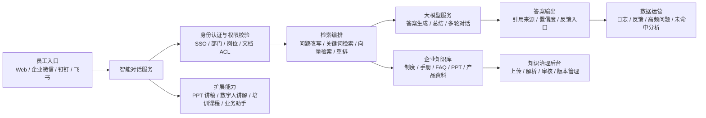

# 智能客服方案研究及规划

## 一、项目背景

随着企业业务规模扩大，员工在日常工作中会频繁查询制度流程、培训资料、产品手册、销售话术、IT 支持说明、客服 SOP、合规要求等内部知识。传统知识管理方式通常存在以下问题：

- 资料分散在网盘、IM 群、邮件、OA、培训平台等多个系统中，员工查找成本高。
- 培训手册、制度文件、PPT 等内容更新后，员工不一定能及时获取最新版本。
- HR、IT、运营、客服、销售支持等部门需要反复回答大量重复问题。
- 新员工培训依赖人工讲解，资料复用效率低，培训质量不稳定。
- 企业知识沉淀缺少反馈闭环，无法识别高频问题和知识缺口。

本项目拟建设一套面向企业内部员工使用的智能客服对话系统。系统可接入公司培训手册、制度文件、产品资料、FAQ、PPT 等内容，员工通过自然语言对话快速获取可信答案；后续扩展 PPT 自动生成讲稿、数字人讲解、培训课程化、业务系统操作助手等能力，逐步形成企业级智能知识与培训平台。

## 二、建设目标

本项目的核心目标是让员工“问得到、答得准、查得到来源、守得住权限”。

### 2.1 业务目标

- 降低员工查找制度、流程、产品资料和培训资料的时间成本。
- 减少 HR、IT、运营、客服支持等部门的重复答疑工作量。
- 将分散的企业资料沉淀为可检索、可追溯、可运营的知识资产。
- 提升新员工培训和内部知识传播效率。
- 为后续数字人培训、自动课程生成和业务助手能力打好基础。

### 2.2 产品目标

- 支持员工上传或管理员导入 PDF、Word、PPT、Excel、网页、Markdown 等资料。
- 支持基于企业资料的多轮问答，并提供引用来源、文件名称、章节或页码。
- 支持按照部门、岗位、项目组、密级控制知识访问范围。
- 支持用户反馈、问题纠错、未命中问题收集和知识库持续优化。
- 支持 PPT 自动解析、讲稿生成、语音讲解和数字人讲解的扩展能力。

### 2.3 技术目标

- 采用 RAG（Retrieval-Augmented Generation，检索增强生成）架构，减少模型幻觉。
- 建立文档解析、切分、向量化、检索、重排、回答生成、引用溯源的完整链路。
- 支持混合部署：企业核心数据和权限控制在企业侧，模型与数字人能力可按合规要求接入云服务或私有化能力。
- 建立日志审计、敏感信息保护、权限隔离、提示词注入防护等安全机制。

## 三、用户与场景

### 3.1 目标用户

| 用户角色 | 使用诉求 | 典型问题 |
| --- | --- | --- |
| 普通员工 | 快速查询制度、流程、培训资料 | “差旅报销标准是什么？”“新员工培训第三天学什么？” |
| 新员工 | 快速熟悉公司制度和岗位知识 | “试用期考核流程是什么？”“销售系统怎么开通权限？” |
| HR/行政/IT 支持 | 减少重复答疑，统一回复口径 | “如何让员工自助查询常见问题？” |
| 培训负责人 | 将 PPT、手册转为课程和讲解内容 | “能否自动把培训 PPT 生成讲稿和视频？” |
| 业务主管 | 查看员工高频问题和知识盲区 | “哪些制度最常被问？”“哪些培训内容员工不理解？” |
| 系统管理员 | 管理知识库、权限、模型配置和日志 | “哪些文档可被哪些部门访问？” |

### 3.2 核心使用场景

1. 员工打开 Web 端智能客服，输入问题，系统基于公司资料给出答案和来源。
2. 管理员上传培训手册或制度文件，系统自动解析并加入知识库。
3. 员工追问细节，系统结合上下文继续回答，但仍以企业资料为依据。
4. 用户发现答案不准确时提交反馈，管理员在后台查看并修正知识库。
5. 培训负责人上传 PPT，系统自动生成逐页讲稿，并可生成语音或数字人讲解视频。
6. 管理者查看数据看板，了解高频问题、未命中问题、资料使用情况和员工满意度。

## 四、总体方案

系统采用“知识库 + RAG 检索增强生成 + 权限控制 + 反馈运营”的总体思路。一期优先建设企业知识问答能力，二期扩展培训与数字人能力，三期接入业务系统形成智能工作助手。

### 4.1 建设原则

- 先问答，后培训，再办事：先把知识问答做准确，再扩展数字人和业务操作。
- 先引用，后生成：模型回答必须基于检索到的资料，并尽量给出来源。
- 先权限，后检索：检索前完成权限过滤，避免无权限资料进入模型上下文。
- 先运营，后优化：通过反馈、日志和未命中问题持续改进知识库。
- 不自研数字人底层模型：优先接入成熟数字人服务，降低成本和交付风险。

### 4.2 部署模式

默认采用混合部署模式：

- 企业侧：文件存储、知识库索引、权限系统、用户数据、日志审计、管理后台。
- 云服务或专有云：大模型推理、语音合成、数字人视频生成等能力。
- 可选私有化：对于金融、政企、制造等高安全场景，可将大模型和向量数据库部署在企业内网。

## 五、核心功能规划

### 5.1 员工智能问答

- 支持自然语言提问、多轮追问、上下文理解。
- 支持基于企业资料回答，不确定时明确提示“未找到明确依据”。
- 回答中展示引用来源，包括文件名、章节、页码、更新时间。
- 支持常见问题推荐、相关问题推荐和继续追问。
- 支持点赞、点踩、纠错、转人工或提交工单。

### 5.2 企业知识库管理

- 支持上传 PDF、Word、PPT、Excel、Markdown、TXT、网页链接等资料。
- 支持文件解析、OCR、文本清洗、章节识别、切分、去重和向量化。
- 支持文档标签、适用部门、密级、版本号、有效期、发布状态管理。
- 支持知识审核流程，草稿、待审核、已发布、已下线状态可追踪。
- 支持历史版本保留和回滚。

### 5.3 权限与组织管理

- 支持企业 SSO、LDAP、企业微信、钉钉、飞书等身份体系接入。
- 支持按组织、部门、岗位、项目组、人员、文档密级配置权限。
- 检索时基于用户权限过滤知识片段，防止越权访问。
- 管理员可查看权限策略、访问日志和异常访问记录。

### 5.4 反馈闭环与知识运营

- 收集用户点赞、点踩、纠错说明、未解决问题。
- 统计高频问题、低满意回答、无答案问题、热门文档。
- 支持管理员将高频问题沉淀为 FAQ。
- 支持对低质量回答进行人工标注，优化切分、召回和提示词策略。

### 5.5 PPT 自动讲稿与数字人讲解

- 支持上传 PPT，自动提取页面标题、正文、备注、图片和结构信息。
- 自动生成逐页讲稿，可按正式、轻松、培训、销售等风格调整。
- 支持管理员编辑讲稿、调整语速、音色、字幕和页面停留时间。
- 支持生成语音讲解或数字人讲解视频。
- 数字人能力优先接入成熟服务，不在一期自研底层视频生成模型。
- 生成内容发布到培训中心，支持员工观看、收藏、评论和学习进度记录。

### 5.6 数据看板

- 展示问题总量、活跃用户、回答满意度、知识命中率、平均响应时间。
- 展示未命中问题、热门问题、热门文档、部门使用排行。
- 展示培训内容生成数量、观看次数、完课率和测验通过率。
- 支持按部门、时间、知识库、入口渠道筛选。

## 六、技术架构设计

### 6.1 核心技术链路

1. 文件上传：管理员或授权员工上传资料。
2. 文件解析：提取文本、表格、图片、备注、页码、章节结构。
3. 文本切分：按标题、段落、语义边界切分为知识片段。
4. 元数据生成：记录文件名、页码、章节、部门、密级、版本、标签。
5. 索引构建：生成向量索引，同时保留关键词索引。
6. 用户提问：识别用户身份、组织、权限和问题意图。
7. 检索召回：在权限范围内进行向量检索和关键词检索。
8. 结果重排：按语义相关性、时效性、文档权威性排序。
9. 回答生成：大模型基于召回片段生成答案，并输出引用来源。
10. 反馈记录：保存问题、召回片段、回答、来源、用户反馈和日志。

### 6.2 推荐技术选型

| 模块 | 推荐选型 | 说明 |
| --- | --- | --- |
| 前端 | React / Vue | Web 端员工入口和管理后台 |
| 后端 | Java Spring Boot / Python FastAPI / Node.js | 按团队技术栈选择 |
| 数据库 | PostgreSQL / MySQL | 存储用户、权限、文档元数据、日志 |
| 向量库 | pgvector / Milvus / Elasticsearch / OpenSearch / Azure AI Search | 支持语义检索 |
| 文件解析 | Apache Tika / Unstructured / PaddleOCR / Office 解析工具 | 解析 PDF、Word、PPT、图片 |
| 大模型 | OpenAI / Azure OpenAI / 通义千问 / DeepSeek / 私有化模型 | 按合规、成本、效果选择 |
| 数字人 | Azure Speech Avatar / HeyGen / Synthesia / D-ID / 国内数字人服务 | 优先成熟服务集成 |
| 对象存储 | MinIO / OSS / S3 | 存储原始文件、图片、音频、视频 |
| 身份认证 | SSO / LDAP / 企业微信 / 钉钉 / 飞书 | 企业统一登录 |
| 监控日志 | Prometheus / Grafana / ELK | 性能监控和审计追踪 |

### 6.3 RAG 策略

- 混合检索：同时使用关键词检索和向量检索，提升召回质量。
- 权限过滤：检索前基于用户身份过滤文档和知识片段。
- 重排模型：对召回结果进行二次排序，提升准确性。
- 引用约束：回答必须标注来源，无法确认时降级回答。
- 版本优先：默认优先使用最新有效版本资料。
- 提示词防护：要求模型忽略文档中的恶意指令，只把文档当作知识来源。

### 6.4 PPT 数字人技术链路

1. PPT 文件解析，提取页面结构、备注和视觉元素。
2. 基于每页内容生成讲稿初稿。
3. 管理员在线编辑和审核讲稿。
4. 选择数字人形象、音色、语言、字幕样式和背景。
5. 调用语音合成或数字人服务生成音频/视频。
6. 生成课程目录、字幕、封面、观看链接和学习记录。

## 七、数据安全与权限治理

### 7.1 数据分级

建议将资料分为以下等级：

| 等级 | 示例 | 访问策略 |
| --- | --- | --- |
| 公开资料 | 企业文化、通用流程、公开培训资料 | 全员可访问 |
| 内部资料 | HR 制度、IT 流程、产品培训资料 | 员工登录后访问 |
| 部门资料 | 销售话术、客服 SOP、部门周报 | 指定部门或岗位访问 |
| 敏感资料 | 财务、法务、战略、客户隐私资料 | 严格授权、审计、必要时禁止进入外部模型 |

### 7.2 安全控制

- 身份认证：统一接入企业身份体系，支持单点登录。
- 权限隔离：文档、知识片段、对话记录均绑定访问权限。
- 敏感信息保护：对身份证、手机号、客户信息、财务数据等进行识别和脱敏。
- 日志审计：记录用户提问、知识召回、答案生成、文件访问、管理员操作。
- 输出约束：禁止输出无权限内容、敏感信息和大段原文复制。
- 提示词注入防护：文档内容中的“忽略系统规则”等指令不应被执行。
- 数字人合规：使用真实人物形象或声音时必须有授权记录和用途审批。

### 7.3 模型使用策略

- 低敏资料可使用云端大模型，提升效果和上线速度。
- 中高敏资料可使用专有云或私有化模型。
- 极高敏资料可仅做检索和摘要，不发送到外部模型。
- 对模型输入和输出进行审计、脱敏和留痕。

## 八、实施路线图

| 阶段 | 时间 | 建设重点 | 主要交付 |
| --- | --- | --- | --- |
| 第 1 阶段：MVP | 0-2 个月 | 企业知识问答闭环 | Web 员工端、文档上传、知识库解析、RAG 问答、来源引用、基础后台 |
| 第 2 阶段：企业可用版 | 2-4 个月 | 权限、运营、企业入口 | 权限体系、SSO、企业微信/钉钉/飞书入口、反馈闭环、数据看板 |
| 第 3 阶段：培训增强版 | 4-6 个月 | PPT 讲稿与数字人培训 | PPT 解析、讲稿生成、语音讲解、数字人视频、课程发布、学习记录 |
| 第 4 阶段：业务助手版 | 6 个月后 | 系统集成与智能体 | OA/HR/CRM/工单系统集成、工具调用、审批流、多智能体工作流 |

### 8.1 MVP 建议范围

MVP 不建议一次性覆盖所有部门和全部资料，建议选择 2-3 类高价值知识先试点：

- HR 制度与新员工培训资料。
- IT 支持手册与常见问题。
- 产品培训手册或客服 SOP。

MVP 成功后，再逐步扩展到销售、客服、财务、法务、研发等更多知识场景。

## 九、团队与成本估算

### 9.1 团队配置

| 角色 | 人数建议 | 职责 |
| --- | --- | --- |
| 产品经理 | 1 | 需求梳理、原型设计、验收指标、运营机制 |
| 前端工程师 | 1-2 | 员工端、管理后台、数据看板 |
| 后端工程师 | 2 | 用户权限、知识库、对话服务、系统集成 |
| AI/算法工程师 | 1-2 | RAG、文档解析、向量检索、提示词、评估体系 |
| 测试工程师 | 1 | 功能测试、权限测试、问答质量测试 |
| 运维/DevOps | 0.5-1 | 部署、监控、日志、安全配置 |
| 业务知识管理员 | 1-2 | 资料整理、知识审核、反馈运营 |

### 9.2 成本级别

| 方案 | 适用情况 | 成本特点 |
| --- | --- | --- |
| 低成本试点 | 单部门、小规模资料、Web 入口 | 使用云端模型和托管服务，开发周期短，适合验证价值 |
| 中等投入 | 多部门、权限体系、企业入口、数据看板 | 建设企业级基础能力，适合正式上线 |
| 高投入私有化 | 高安全要求、内网部署、私有模型、数字人深度定制 | 成本高、周期长，但数据可控性最强 |

### 9.3 主要成本构成

- 人力开发成本。
- 大模型调用成本或私有化模型部署成本。
- 向量数据库、对象存储、服务器和带宽成本。
- 文件解析、OCR、语音合成和数字人生成成本。
- 企业系统集成、权限改造和安全审计成本。
- 知识整理、标注、运营和持续维护成本。

## 十、风险与应对

| 风险 | 影响 | 应对策略 |
| --- | --- | --- |
| 回答不准确或产生幻觉 | 影响员工信任 | 使用 RAG、来源引用、低置信度降级、人工反馈闭环 |
| 知识库资料过旧 | 回答基于过期制度 | 建立版本管理、有效期提醒、资料负责人机制 |
| 权限泄露 | 导致敏感信息外泄 | 检索前权限过滤、文档 ACL、日志审计、敏感信息脱敏 |
| 文档解析质量差 | 影响检索和回答 | 优化 OCR、表格解析、切分策略和人工审核 |
| 员工使用率低 | 项目价值难体现 | 选择高频刚需场景试点，接入常用办公入口 |
| 数字人生成成本高 | 影响规模化使用 | 二期接入成熟服务，限制生成权限和审批流程 |
| 业务系统集成复杂 | 延误后续扩展 | 三期再做工具调用，先从低风险查询类接口开始 |

## 十一、验收指标

### 11.1 MVP 验收指标

| 指标 | 建议目标 |
| --- | --- |
| 回答准确率 | 人工抽检达到 80% 以上 |
| 引用覆盖率 | 有明确资料依据的问题，引用覆盖率达到 90% 以上 |
| 知识命中率 | 试点资料范围内问题命中率达到 75% 以上 |
| 平均响应时间 | 常规问答 5 秒内返回 |
| 用户满意度 | 点赞率或满意率达到 70% 以上 |
| 未命中问题收集 | 支持完整记录和后台查看 |
| 权限测试 | 无越权访问高风险问题 |

### 11.2 正式上线指标

- 人工重复咨询量下降 30% 以上。
- 高频问题 FAQ 覆盖率持续提升。
- 知识库资料更新后 1 个工作日内完成索引更新。
- 培训资料制作效率提升 50% 以上。
- 数字人课程生成从人工录制的数小时缩短到分钟级或小时级。
- 关键操作日志完整留存，满足内部审计要求。

## 十二、后续演进方向

### 12.1 企业智能培训平台

在知识问答基础上，将培训手册、制度文件和 PPT 转换为可学习、可测试、可追踪的课程体系，形成“资料上传 - 自动讲稿 - 数字人讲解 - 测验生成 - 学习记录”的完整闭环。

### 12.2 业务流程助手

接入 OA、HR、CRM、工单、财务等系统，让员工不仅能问问题，还能在权限范围内完成查询和流程发起。例如查询年假余额、提交 IT 工单、生成客户拜访纪要、查询合同审批进度等。

### 12.3 多智能体协作

针对不同业务角色建设专属智能体，例如 HR 助手、IT 助手、销售培训助手、客服质检助手、知识库运营助手。每个智能体拥有独立知识范围、工具权限和工作流。

### 12.4 主动知识运营

系统根据高频问题、未命中问题、低满意回答自动提示知识管理员补充或更新资料。新制度发布后，可主动推送给相关部门并生成问答摘要和培训材料。

## 结论

智能客服系统的建设应从企业内部知识问答切入，优先解决员工查资料难、重复答疑多、知识沉淀弱的问题。一期重点是把知识库、权限、检索、回答和引用链路做扎实；二期再扩展 PPT 讲稿、数字人讲解和培训课程化；三期进一步接入业务系统，升级为企业员工的智能工作助手。

该路径投入可控、价值清晰、风险可分阶段治理，适合作为企业 AI 应用落地的优先项目。
