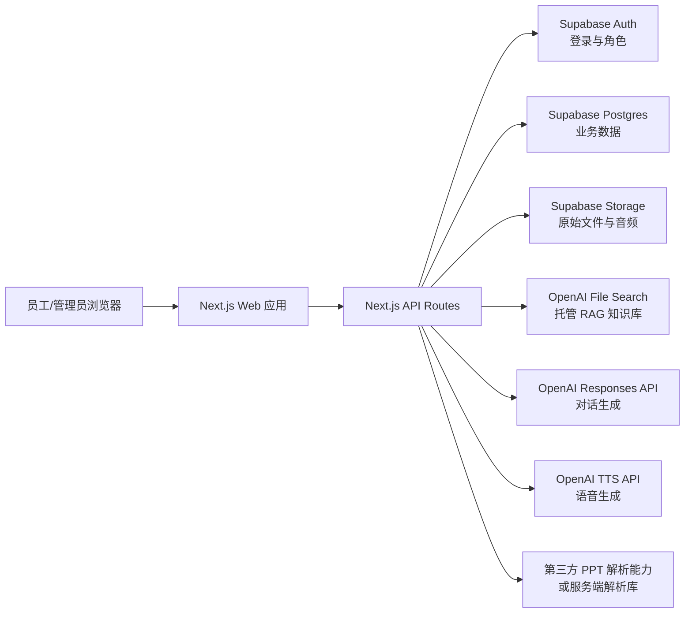

# 智能客服项目开发实施计划

## 一、开发策略

当前约束是没有大型服务器，系统应尽量依赖成熟第三方 API 和托管服务完成核心能力。第一版不做复杂私有化部署，也不自研向量数据库、语音模型或数字人模型，而是先做一个轻量、可用、可迭代的 Web 应用。

推荐开发路线：

- 前端与后端一体：使用 Next.js 开发 Web 应用和 API Routes。
- 数据库与登录：使用 Supabase 托管 PostgreSQL、Auth、Storage。
- RAG 知识库：优先使用 OpenAI File Search / Vector Store 托管知识库。
- 大模型问答：通过 OpenAI Responses API 调用知识库并生成答案。
- 语音能力：先用 TTS 文本转语音代替数字人讲解。
- 部署方式：使用 Vercel 部署 Web 应用，Supabase 和 OpenAI 负责托管数据与 AI 能力。

这种方案的优势是开发速度快、服务器成本低、后期可平滑升级。OpenAI File Search 支持把文件上传到 vector store，并在回答前进行语义和关键词检索，属于托管工具，不需要我们自己实现向量检索服务。OpenAI TTS 支持将文本转为语音，可先满足 PPT 讲解和答案播报需求。

## 二、一期产品范围

### 2.1 第一版必须完成

第一版目标是做出一个企业内部员工可用的智能知识客服。

员工端：

- 登录。
- 进入智能客服对话页面。
- 输入问题。
- 系统基于企业资料回答。
- 展示引用来源。
- 支持继续追问。
- 支持答案语音播放。
- 支持点赞、点踩和反馈。

管理端：

- 管理员登录。
- 创建知识库。
- 上传 PDF、Word、PPT、TXT、Markdown 等资料。
- 查看资料处理状态。
- 管理资料名称、分类、所属部门、可见范围。
- 查看员工提问记录和反馈。

### 2.2 第一版暂不做

- 不做私有化大模型部署。
- 不自研数字人。
- 不做复杂工作流审批。
- 不接 OA、HR、CRM 等业务系统。
- 不做多租户商业化计费。
- 不做复杂文档协同编辑。

### 2.3 数字人替代方案

数字人功能先降级为“语音讲解”：

- 员工上传 PPT。
- 系统提取 PPT 内容。
- 大模型生成逐页讲稿。
- 用户确认讲稿。
- 系统生成语音音频。
- 前端展示 PPT 页面 + 自动播放语音。

后续如果预算和技术条件成熟，再接入第三方数字人 API，把讲稿和音频升级为数字人视频。

## 三、推荐技术架构



### 3.1 技术选型

| 模块 | 选型 | 原因 |
| --- | --- | --- |
| Web 框架 | Next.js + TypeScript | 前后端一体，适合快速上线 |
| UI | Tailwind CSS + shadcn/ui | 开发效率高，后台和聊天界面都适合 |
| 登录 | Supabase Auth | 无需自建认证服务器 |
| 数据库 | Supabase PostgreSQL | 托管数据库，适合中小规模项目 |
| 文件存储 | Supabase Storage | 保存原始文件、音频、PPT 资源 |
| RAG 知识库 | OpenAI File Search / Vector Store | 不需要自建向量库和检索服务 |
| 大模型 | OpenAI Responses API | 统一完成对话、工具调用、文件检索 |
| 语音 | OpenAI TTS API | 替代数字人第一版讲解能力 |
| 部署 | Vercel | 免服务器运维，适合 Next.js |

### 3.2 为什么不用自建向量库

自建向量库需要处理切分、embedding、索引、召回、重排、权限过滤、运维监控。当前没有大型服务器，第一版不建议上 Milvus、Elasticsearch、OpenSearch 等重型组件。

第一版用 OpenAI File Search 托管 RAG 能力，系统只维护：

- 文件与知识库元数据。
- 用户与权限。
- vector store ID。
- 对话记录。
- 用户反馈。

如果后续出现以下情况，再考虑迁移到 Supabase pgvector 或独立向量库：

- 需要非常细粒度的知识片段权限。
- 成本需要更强控制。
- 需要接多个模型供应商。
- 数据不能进入外部托管知识库。
- 需要自定义召回、重排、混合检索策略。

## 四、系统模块设计

### 4.1 员工端

页面：

- `/login`：登录页。
- `/chat`：智能客服对话页。
- `/history`：历史会话页。
- `/training`：培训讲解列表页，二期实现。
- `/training/[id]`：PPT 语音讲解页，二期实现。

核心交互：

- 左侧显示会话列表。
- 中间显示聊天消息。
- 右侧或答案下方显示引用来源。
- 输入框支持普通问题和继续追问。
- 答案区域提供“播放语音”“复制”“点赞”“点踩”“反馈”按钮。

### 4.2 管理端

页面：

- `/admin`：管理首页。
- `/admin/knowledge-bases`：知识库管理。
- `/admin/documents`：资料管理。
- `/admin/documents/upload`：资料上传。
- `/admin/conversations`：对话记录。
- `/admin/feedback`：用户反馈。
- `/admin/training`：PPT 讲解任务，二期实现。
- `/admin/settings`：模型、API、权限配置。

核心能力：

- 创建知识库，对应一个 OpenAI vector store。
- 上传文件到 Supabase Storage。
- 同步上传文件到 OpenAI File API，并加入指定 vector store。
- 记录文件状态：上传中、处理中、可用、失败。
- 设置知识库可见范围：全员、指定部门、指定角色。
- 查看员工问题、答案、引用、反馈和满意度。

### 4.3 API 设计

| API | 方法 | 用途 |
| --- | --- | --- |
| `/api/auth/me` | GET | 获取当前用户和角色 |
| `/api/knowledge-bases` | GET/POST | 查询或创建知识库 |
| `/api/documents/upload` | POST | 上传资料并加入知识库 |
| `/api/documents` | GET | 查询资料列表 |
| `/api/documents/[id]` | GET/PATCH | 查看或更新资料元数据 |
| `/api/chat` | POST | 发起问答，调用知识库检索和大模型 |
| `/api/conversations` | GET/POST | 查询或创建会话 |
| `/api/conversations/[id]/messages` | GET | 查询会话消息 |
| `/api/feedback` | POST | 提交点赞、点踩和纠错反馈 |
| `/api/tts` | POST | 将答案或讲稿转为语音 |
| `/api/ppt/script` | POST | 解析 PPT 并生成逐页讲稿，二期实现 |

### 4.4 数据表设计

#### users

存储用户基础信息。Supabase Auth 负责认证，业务表保存扩展字段。

| 字段 | 说明 |
| --- | --- |
| id | 用户 ID |
| email | 邮箱 |
| name | 姓名 |
| role | `admin` / `employee` |
| department | 部门 |
| created_at | 创建时间 |

#### knowledge_bases

| 字段 | 说明 |
| --- | --- |
| id | 知识库 ID |
| name | 知识库名称 |
| description | 说明 |
| openai_vector_store_id | OpenAI vector store ID |
| visibility | `all` / `department` / `admin_only` |
| departments | 可见部门列表 |
| created_by | 创建人 |
| created_at | 创建时间 |

#### documents

| 字段 | 说明 |
| --- | --- |
| id | 文档 ID |
| knowledge_base_id | 所属知识库 |
| title | 文档标题 |
| file_name | 原文件名 |
| file_type | 文件类型 |
| storage_path | Supabase Storage 路径 |
| openai_file_id | OpenAI 文件 ID |
| status | `uploading` / `processing` / `ready` / `failed` |
| department | 所属部门 |
| tags | 标签 |
| created_by | 上传人 |
| created_at | 创建时间 |

#### conversations

| 字段 | 说明 |
| --- | --- |
| id | 会话 ID |
| user_id | 用户 ID |
| title | 会话标题 |
| created_at | 创建时间 |
| updated_at | 更新时间 |

#### messages

| 字段 | 说明 |
| --- | --- |
| id | 消息 ID |
| conversation_id | 会话 ID |
| role | `user` / `assistant` |
| content | 消息内容 |
| citations | 引用来源 JSON |
| model | 使用模型 |
| created_at | 创建时间 |

#### feedback

| 字段 | 说明 |
| --- | --- |
| id | 反馈 ID |
| message_id | 对应回答 |
| user_id | 用户 ID |
| rating | `like` / `dislike` |
| comment | 反馈内容 |
| created_at | 创建时间 |

#### training_jobs

二期使用。

| 字段 | 说明 |
| --- | --- |
| id | 任务 ID |
| title | 培训标题 |
| ppt_document_id | PPT 文档 ID |
| script_json | 逐页讲稿 |
| audio_paths | 音频文件路径 |
| status | `draft` / `generating` / `ready` / `failed` |
| created_by | 创建人 |
| created_at | 创建时间 |

## 五、核心流程设计

### 5.1 资料上传入库流程

1. 管理员在 `/admin/documents/upload` 选择知识库和文件。
2. 前端调用 `/api/documents/upload`。
3. 服务端校验管理员权限和文件类型。
4. 文件保存到 Supabase Storage。
5. 文件上传到 OpenAI File API。
6. 文件加入对应 OpenAI vector store。
7. 数据库写入 documents 记录。
8. 前端展示资料状态。
9. 后台定时或手动刷新处理状态。

### 5.2 员工问答流程

1. 员工在 `/chat` 输入问题。
2. 前端调用 `/api/chat`，传入 conversation_id 和问题。
3. 服务端读取当前用户权限。
4. 服务端查询用户可访问的 knowledge_bases。
5. 将允许访问的 vector_store_id 传给 OpenAI Responses API。
6. 模型使用 file_search 从知识库检索相关资料。
7. 模型基于检索结果生成答案。
8. 服务端解析并保存答案、引用、模型信息。
9. 前端展示答案、引用来源和反馈按钮。

### 5.3 答案语音播放流程

1. 员工点击“播放语音”。
2. 前端调用 `/api/tts`，传入回答文本。
3. 服务端调用 TTS API 生成音频。
4. 音频保存到 Supabase Storage，或直接以流式音频返回。
5. 前端播放音频。

第一版建议优先直接流式返回音频，减少存储和清理逻辑。后续培训讲解类音频再持久化保存。

### 5.4 PPT 语音讲解流程

二期实现，先不做数字人。

1. 管理员上传 PPT。
2. 系统提取每页文本和备注。
3. 调用大模型生成逐页讲稿。
4. 管理员编辑确认讲稿。
5. 系统为每页讲稿生成语音。
6. 前端展示 PPT 页面和对应音频。
7. 员工可以按页播放、暂停、切换、倍速观看。

## 六、开发阶段规划

### 第 0 阶段：项目初始化，1-2 天

目标：创建可运行的基础项目。

交付：

- Next.js + TypeScript 项目。
- Tailwind CSS 和基础 UI 组件。
- Supabase 客户端配置。
- OpenAI API 客户端配置。
- 环境变量模板 `.env.example`。
- 基础页面布局：登录页、员工端、管理端。

验收：

- 本地 `npm run dev` 可启动。
- 能打开首页、登录页、聊天页、管理页。
- 环境变量缺失时有明确错误提示。

### 第 1 阶段：账号与权限，2-3 天

目标：完成最小可用登录和角色区分。

交付：

- Supabase Auth 登录。
- 用户角色：管理员、员工。
- 管理端路由保护。
- 员工端路由保护。
- 基础用户信息表。

验收：

- 未登录用户无法访问 `/chat` 和 `/admin`。
- 员工无法访问管理员页面。
- 管理员可以进入资料管理页面。

### 第 2 阶段：知识库和资料上传，4-6 天

目标：管理员可创建知识库并上传资料。

交付：

- 知识库列表、创建、编辑。
- 文档上传页面。
- 文件保存到 Supabase Storage。
- 文件同步到 OpenAI vector store。
- 文档状态展示。
- 文件类型和大小限制。

验收：

- 管理员可以创建知识库。
- 管理员可以上传 PDF、TXT、Markdown、Word、PPT、Excel，文本型 PDF 按页入库，扫描件 PDF 可接 OCR。
- 上传后的资料可以进入 OpenAI vector store。
- 文档列表能看到处理状态。

### 第 3 阶段：RAG 对话，5-7 天

目标：员工可以基于知识库问答。

交付：

- 聊天页面。
- 会话创建和历史记录。
- `/api/chat` 对接 OpenAI Responses API。
- file_search 调用指定 vector stores。
- 答案展示。
- 引用来源展示。
- 流式输出，提升体验。

验收：

- 员工能对已上传资料提问。
- 系统回答能引用资料来源。
- 无相关资料时能提示“未找到明确依据”。
- 多轮对话能保留上下文。

### 第 4 阶段：反馈、日志与管理看板，3-5 天

目标：形成知识运营闭环。

交付：

- 点赞、点踩、纠错反馈。
- 对话记录管理。
- 高频问题列表。
- 低满意回答列表。
- 简单统计看板。

验收：

- 员工可提交反馈。
- 管理员能看到问题、答案、引用和反馈。
- 管理员能识别未命中问题。

### 第 5 阶段：语音播报，2-3 天

目标：用语音能力替代第一版数字人。

交付：

- `/api/tts`。
- 答案语音播放按钮。
- 语音加载、播放、暂停状态。
- TTS 成本和长度限制。

验收：

- 员工可以播放回答语音。
- 长文本自动截断或提示生成较慢。
- API 失败时前端有清晰错误提示。

### 第 6 阶段：PPT 语音讲解，7-10 天

目标：实现培训资料的轻量讲解能力。

交付：

- PPT 上传。
- PPT 文本提取。
- 逐页讲稿生成。
- 讲稿编辑页面。
- 逐页语音生成。
- 培训讲解播放页。

验收：

- 管理员可以上传 PPT 并生成讲稿。
- 管理员可以修改讲稿。
- 系统可以生成语音讲解。
- 员工可以按页播放培训内容。

### 第 7 阶段：部署与试点，2-3 天

目标：部署到线上环境并做小范围试点。

交付：

- Vercel 生产部署。
- Supabase 生产环境。
- 环境变量配置。
- 基础访问控制。
- 试点资料导入。
- 使用说明文档。

验收：

- 指定员工可登录使用。
- 管理员可上传资料和查看反馈。
- 线上问答稳定可用。

## 七、推荐开发顺序

建议按以下顺序推进，避免一开始被复杂功能拖慢：

1. 搭项目骨架。
2. 做登录和角色。
3. 做知识库创建。
4. 做资料上传到 OpenAI vector store。
5. 做聊天问答。
6. 做引用来源。
7. 做反馈和对话记录。
8. 做答案语音播报。
9. 做 PPT 讲稿生成。
10. 做 PPT 语音讲解。
11. 再考虑数字人 API。

## 八、环境变量规划

第一版需要以下环境变量：

```env
NEXT_PUBLIC_SUPABASE_URL=
NEXT_PUBLIC_SUPABASE_ANON_KEY=
SUPABASE_SERVICE_ROLE_KEY=
OPENAI_API_KEY=
OPENAI_CHAT_MODEL=
OPENAI_TTS_MODEL=
OPENAI_TTS_VOICE=
APP_BASE_URL=
MAX_UPLOAD_MB=
```

默认值建议：

- `OPENAI_CHAT_MODEL`：选择当前稳定、成本可控的对话模型。
- `OPENAI_TTS_MODEL`：选择当前稳定的 TTS 模型。
- `OPENAI_TTS_VOICE`：先固定一个中文效果较自然的声音。
- `MAX_UPLOAD_MB`：第一版限制为 20MB，避免上传过大资料导致处理失败。

## 九、MVP 验收清单

MVP 完成时，应满足以下条件：

- 管理员能创建知识库。
- 管理员能上传资料。
- 员工能基于资料进行问答。
- 回答能展示引用来源。
- 员工能提交反馈。
- 管理员能查看对话和反馈。
- 员工能播放答案语音。
- 系统部署在 Vercel，可小范围试点。
- 不依赖自建大型服务器。

## 十、后续升级路径

### 10.1 从托管 RAG 升级到自控 RAG

如果后续需要更强可控性，可将 OpenAI File Search 替换或补充为：

- Supabase pgvector。
- Pinecone。
- Weaviate Cloud。
- Qdrant Cloud。
- Elasticsearch / OpenSearch 托管版。

升级后可实现更细粒度的 chunk 权限、召回调参、重排策略和跨模型兼容。

### 10.2 从语音讲解升级到数字人

当 PPT 讲稿和语音讲解跑通后，再接入数字人 API：

- 输入：讲稿、音频、数字人形象、背景配置。
- 输出：视频文件。
- 存储：Supabase Storage 或对象存储。
- 展示：培训播放页播放视频。

数字人应作为增强能力，不影响知识问答主链路。

### 10.3 从知识客服升级到业务助手

后续可接入企业内部系统：

- OA：查询审批进度、发起流程。
- HR：查询假期、制度、培训记录。
- IT 工单：提交故障、查询进度。
- CRM：查询客户资料和销售话术。

接入业务系统时必须增加工具调用权限、参数校验、操作确认和审计日志。

## 十一、当前最佳下一步

建议下一步直接进入项目初始化：

1. 创建 Next.js 项目。
2. 接入 Supabase。
3. 接入 OpenAI API。
4. 先做登录、知识库、资料上传、聊天问答四个最小闭环。

只要这四个闭环跑通，项目就已经具备真实试点价值。PPT 语音讲解可以作为第二个迭代加入，数字人则保留为后续增强方向。
